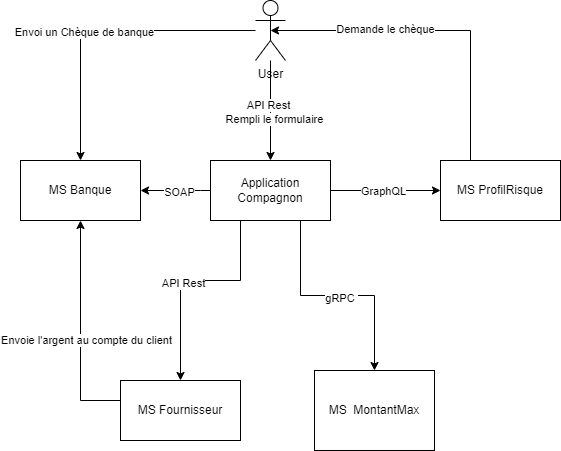

# Application Compagnon – README détaillé

## Table des matières

1. [Présentation](#présentation)  
2. [Architecture](#architecture)  
3. [Choix technologiques](#choix-technologiques)  
4. [Prérequis](#prérequis)  
5. [Installation](#installation)  
6. [Configuration](#configuration)  
7. [Démarrage des microservices](#démarrage-des-microservices)  
8. [Démarrage de l’application compagnon](#démarrage-de-lapplication-compagnon)  
9. [Endpoints](#endpoints)  
10. [Utilisation](#utilisation)  
11. [Tests](#tests)  
12. [Contribuer](#contribuer)    

---

## Présentation

L’**Application Compagnon** orchestre un workflow de demande de prêt en interagissant avec plusieurs microservices :

- **ms_montantmax** (gRPC) : vérification du montant maximal autorisé.  
- **ms_profilrisque** (GraphQL) : évaluation du profil de risque client.  
- **ms_banque** (SOAP asynchrone) : validation du chèque de banque.  
- **ms_fournisseur** (REST) : libération et transfert des fonds.  

Chaque service est containerisé et déployé via Docker Compose. Grâce à la fonctionnalité de traçabilité, vous pouvez récupérer l’historique complet des appels pour chaque demande.

---

## Architecture



1. Le client envoie une requête POST `/loan` à l’app Flask.  
2. L’app appelle le service gRPC **ms_montantmax**.  
3. Si validé, elle interroge **ms_profilrisque** via GraphQL.  
4. Si le risque est acceptable, elle soumet un chèque à **ms_banque** (SOAP async).  
5. Une fois le callback reçu, elle interroge **ms_fournisseur** pour le transfert.  
6. Le client est notifié du résultat.  

---

## Choix technologiques

- **gRPC (ms_montantmax)** : protocole binaire performant pour appels interservices, idéal pour validations simples et rapides (faible latence, typage strict).  
- **GraphQL (ms_profilrisque)** : requête déclarative permettant de ne récupérer que les champs nécessaires (ici `riskProfile`), ce qui simplifie l’évolution du schéma.  
- **SOAP asynchrone (ms_banque)** : choix historique pour les interactions bancaires, supporte les callbacks via WS-Addressing et garantit la robustesse et la traçabilité des messages.  
- **REST (ms_fournisseur)** : simplicité d’implémentation pour créer et interroger une ressource `fundTransfers`, bonnes pratiques HTTP (codes de statut, liens hypermedia).  

---

## Prérequis

- **Docker** & **Docker Compose**  
- **Python 3.10+** (pour exécution locale hors conteneur)    
- **jq** (fortement recommandé pour formater le JSON)  
  ```bash
  # Debian/Ubuntu
  sudo apt-get update && sudo apt-get install -y jq

  # macOS (Homebrew)
  brew install jq
  ```

*Si vous ne pouvez pas installer `jq`, remplacez*

```bash
| jq
```

*par*

```bash
| python3 -m json.tool
```

---

## Installation

1. Cloner le dépôt :

   ```bash
   git clone https://github.com/AdrienBenthami/Webservice.git
   cd Webservice
   ```
2. Démarrer tous les services :

   ```bash
   docker compose up --build -d
   ```

---

## Configuration

Les URLs des microservices sont définies dans **`src/app/app.py`** via des variables d’environnement :

```bash
MS_MONTANTMAX_ADDRESS=ms_montantmax:50051
MS_PROFILRISQUE_URL=http://ms_profilrisque:5001/graphql
MS_BANQUE_URL=http://ms_banque:5002/
MS_FOURNISSEUR_URL=http://ms_fournisseur:5003/fundTransfers
```

---

## Démarrage des microservices

```bash
docker compose ps
```

Assurez-vous que chaque service est `healthy`.

---

## Démarrage de l’application compagnon

Lancer l’app Flask (port 5000) :

```bash
# via Docker Compose (le service "app" démarre automatiquement)
docker compose ps

# en local sans conteneur
cd src/app
source venv/bin/activate   # si venv créé
pip install -r requirements.txt
python app.py
```

---

## Endpoints

### Service principal (Flask App)

* **GET** `/health`

  * Vérifie que l’application est opérationnelle.
  * **Réponse** : `200 OK` `{ "status": "ok" }`

* **POST** `/loan`

  * Soumet une demande de prêt.
  * **Payload JSON** :

    ```json
    {
      "id": "client1",
      "personal_info": "M. Dupont",
      "loan_amount": 8000
    }
    ```
  * **Réponse** :

    * `200 OK` si la demande est acceptée en attente de chèque :

      ```json
      {
        "status": "pending",
        "request_id": "<UUID>",
        "message": "Veuillez déposer votre chèque en utilisant cet ID"
      }
      ```
    * `400 BAD REQUEST` en cas de refus immédiat ou d’erreur de validation.

* **GET** `/loan/status/{request_id}`

  * Récupère le statut de la demande.
  * **Réponse** :

    * `200 OK` `{ "status": "pending" }`
      ou `{ "status": "approved", "message": "Prêt approuvé et fonds transférés" }`
    * `400 BAD REQUEST` `{ "status": "refused", "reason": "Chèque invalide" }`
    * `404 NOT FOUND` `{ "status": "error", "reason": "ID inconnu" }`

* **GET** `/loan/history/{request_id}`

  * Récupère l’historique complet des appels pour une demande.
  * **Réponse** :
    `200 OK`

    ```json
    {
      "request_id": "<UUID>",
      "history": [ ... ]
    }
    ```

* **POST** `/loan/callback`

  * Point de callback SOAP pour recevoir le verdict du service bancaire.
  * **Payload XML** SOAP :

    ```xml
    <soapenv:Envelope xmlns:soapenv="http://schemas.xmlsoap.org/soap/envelope/">
      <soapenv:Body>
        <ChequeStatusResponse>
          <request_id>...</request_id>
          <status>done</status>
          <verdict>Chèque validé</verdict>
        </ChequeStatusResponse>
      </soapenv:Body>
    </soapenv:Envelope>
    ```
  * **Réponse** : `200 OK` ou `404 NOT FOUND` si l’ID est inconnu.

---

### ms\_montantmax (gRPC)

* **Port** : `50051`
* **Méthode gRPC** : `CheckLoan(LoanRequest) returns (LoanResponse)`

  * **LoanRequest** : `{ float loan_amount = 1; }`
  * **LoanResponse** : `{ bool allowed = 1; string message = 2; }`
* **Healthcheck** : TCP `nc -z localhost 50051`
* **Exemple** :

  ```bash
  grpcurl -plaintext \
    -d '{"loan_amount": 30000}' \
    localhost:50051 ms_montantmax.MontantMaxService/CheckLoan
  ```

---

### ms\_profilrisque (GraphQL)

* **Port** : `5001`
* **Endpoint** : `/graphql`
* **Query** :

  ```graphql
  query($loanAmount: Float!, $clientInfo: String!) {
    riskProfile(loanAmount: $loanAmount, clientInfo: $clientInfo)
  }
  ```
* **Healthcheck** : `GET /health` → `{ "status": "ok" }`
* **Exemple** :

  ```bash
  curl -X POST http://localhost:5001/graphql \
    -H "Content-Type: application/json" \
    -d '{
      "query": "query($loanAmount: Float!, $clientInfo: String!){ riskProfile(loanAmount: $loanAmount, clientInfo: $clientInfo) }",
      "variables": {"loanAmount": 25000, "clientInfo": "Test"}
    }'
  ```

---

### ms\_banque (SOAP asynchrone)

* **Port** : `5002`
* **Endpoint unique** : POST `/`
* **Protocol** : SOAP 1.1
* **Operations** :

  * `SubmitChequeRequest()` → renvoie `request_id`
  * `GetChequeStatus(request_id)` → renvoie un `ChequeStatus` `{ status, verdict }`
  * `UploadCheque(request_id, cheque)` → met à jour le verdict et déclenche le callback.
* **Callback** : l’adresse `ReplyTo` dans l’en-tête SOAP est appelée en POST vers `/loan/callback`.
* **Healthcheck** : TCP `nc -z localhost 5002`
* **Exemple** :

  ```bash
  curl -X POST http://localhost:5002/ \
    -H "Content-Type: application/soap+xml; charset=utf-8" \
    --data '<soapenv:Envelope xmlns:soapenv="http://schemas.xmlsoap.org/soap/envelope/" ...>...</soapenv:Envelope>'
  ```

---

### ms\_fournisseur (REST)

* **Port** : `5003`
* **Endpoints** :

  * **GET** `/health` → `{ "status": "ok" }`
  * **POST** `/fundTransfers`

    * **Payload JSON** : `{ "loan_amount": 12345, "client_id": "clientX" }`
    * **Réponse** : `201 Created` avec `{ "status": "success", "message": ..., "links": {...} }`
  * **GET** `/fundTransfers/{id}/status` → `{ "transfer_id": id, "status": "completed" }`
* **Healthcheck** : `curl -f http://localhost:5003/health`

---

## Utilisation

1. **Créer une demande de prêt** :

   ```bash
   curl -s -X POST http://localhost:5000/loan \
     -H "Content-Type: application/json" \
     -d '{"id":"client1","personal_info":"M. Dupont","loan_amount":8000}' \
   | jq
   ```

2. **Vérifier le statut** :

   ```bash
   curl -s http://localhost:5000/loan/status/<request_id> | jq
   ```

3. **Consulter l’historique des appels** :

   ```bash
   curl -s http://localhost:5000/loan/history/<request_id> | jq
   ```

4. **Soumettre la validation du chèque** :

   ```bash
   curl -s -X POST http://localhost:5000/loan/callback \
     -H "Content-Type: text/xml" \
     --data '<soapenv:Envelope xmlns:soapenv="http://schemas.xmlsoap.org/soap/envelope/"><soapenv:Body><ChequeStatusResponse><request_id><request_id></request_id><status>done</status><verdict>Chèque validé</verdict></ChequeStatusResponse></soapenv:Body></soapenv:Envelope>'
   ```

5. **Vérifier le statut final et l’historique mis à jour** :

   ```bash
   curl -s http://localhost:5000/loan/status/<request_id> | jq
   curl -s http://localhost:5000/loan/history/<request_id> | jq
   ```

---

## Tests

Exécuter tous les tests unitaires et d’intégration, y compris ceux pour `/loan/history` :

```bash
pytest -q
```

---

## Contribuer

Les contributions sont les bienvenues !

1. Forker le dépôt
2. Créer une branche (`git checkout -b feature/ma-fonctionnalité`)
3. Committer vos changements (`git commit -m 'Ajout : ...'`)
4. Pousser (`git push origin feature/ma-fonctionnalité`)
5. Ouvrir une Pull Request

